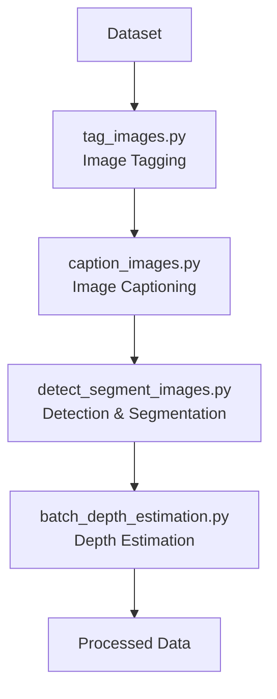

# Cortexia Video Processing Pipeline

A comprehensive computer vision framework for automated image analysis, featuring a three-stage processing pipeline for object tagging, detection/segmentation, and depth estimation.

## Overview

This repository provides a complete workflow for processing image datasets through three sequential stages:

1. **Image Tagging** (`tag_images.py`) - Automatically identifies and tags objects/areas in images using Vision Language Models
2. **Image Captioning** (`caption_images.py`) - Generates detailed captions for each image using a VLM
3. **Object Detection & Segmentation** (`detect_segment_images.py`) - Detects and segments tagged objects using state-of-the-art models
4. **Depth Estimation** (`batch_depth_estimation.py`) - Generates depth maps for processed images

### Pipeline Diagram



## Table of Contents

- [Prerequisites](#prerequisites)
- [Installation](#installation)
- [Quick Start](#quick-start)
- [Running with Docker](#running-with-docker)
- [Detailed Usage](#detailed-usage)
  - [Stage 1: Image Tagging](#stage-1-image-tagging)
  - [Stage 2: Object Detection & Segmentation](#stage-2-object-detection--segmentation)
  - [Stage 3: Depth Estimation](#stage-3-depth-estimation)
- [Configuration](#configuration)
- [Input/Output Formats](#inputoutput-formats)
- [Example Workflow](#example-workflow)
- [Troubleshooting](#troubleshooting)

## Prerequisites

### System Requirements

- Python 3.10 or higher
- CUDA-compatible GPU (recommended for optimal performance)
- At least 16GB RAM (32GB recommended for large datasets)
- 30GB+ free disk space for models and processing

### Required Models and Checkpoints

The pipeline requires several pre-trained models that will be automatically downloaded on first use:

- **Vision Language Model**: Qwen/Qwen2.5-VL-7B-Instruct (for image tagging)
- **Object Detection**: IDEA-Research/grounding-dino-base
- **Segmentation**: facebook/sam-vit-huge
- **Depth Estimation**: DepthPro model (requires `checkpoints/depth_pro.pt`)

## Installation

### 1. Clone the Repository

```bash
git clone --recursive https://github.com/DylanLIiii/cortexia_video.git
cd cortexia_video
```

### 2. Install Dependencies

```bash
# Install the package and all dependencies
pip install -e .

# Or using uv (recommended)
uv sync
```

### 3. Environment Setup
Correctly setup the environment variable for users in CHINA and setup model save dir. 
```bash
export HF_HOME=/vita-vepfs-data/fileset1/usr_data/min.dong/model/huggingface
export HF_ENDPOINT=https://hf-mirror.com
```

### 3. Download Required Models

The models will be automatically downloaded when first used, but you can pre-download them:

```bash
# The DepthPro checkpoint should be placed at:
# checkpoints/depth_pro.pt
```

## Quick Start

For a complete processing pipeline on a dataset:

```bash
# 1. Tag images (identify objects/areas)
python scripts/tag_images.py --folder /path/to/your/dataset --config config/heavy_mode.toml

# 2. Detect and segment objects
python scripts/detect_segment_images.py --folder /path/to/your/dataset --config config/heavy_mode.toml

# 3. Generate depth maps
python scripts/batch_depth_estimation.py --folder /path/to/your/dataset --recursive
```

## Running with Docker

You can also execute the pipeline inside a Docker container.

### Build the Docker image

```bash
docker build -t cortexia-video .
```

### Run the container

Mount a local folder containing your videos (e.g. `/path/to/your/dataset`) and
run any of the processing scripts inside the container:

```bash
docker run --gpus all -v /path/to/your/dataset:/data cortexia-video \
    python scripts/tag_images.py --folder /data --config config/heavy_mode.toml
```

The required models will be downloaded at runtime as described in the
[Prerequisites](#prerequisites).

## Detailed Usage

### Stage 1: Image Tagging

**Purpose**: Automatically identifies and tags passable areas or objects in images using Vision Language Models.

**Script**: `scripts/tag_images.py`

#### Command-Line Arguments

- `--folder` (required): Root folder containing video subfolders with images
- `--config` (optional): Path to configuration file (default: `config/heavy_mode.toml`)
- `--min-images` (optional): Minimum number of JPEG images required per subfolder (default: 5)
- `--categories` (optional): JSON string defining tag categories. This allows for customized, structured tagging instead of a simple keyword list.

#### Usage Examples

```bash
# Basic usage with default settings
python scripts/tag_images.py --folder /path/to/dataset

# Using custom configuration and categories
python scripts/tag_images.py \
    --folder /path/to/dataset \
    --config config/light_mode.toml \
    --categories '{"accessible_area": ["road", "sidewalk", "pathway"], "obstacles": ["vehicle", "cyclist", "pedestrian"]}'

# Process folders with fewer images
python scripts/tag_images.py \
    --folder /path/to/dataset \
    --min-images 3
```

#### Input Structure

```
dataset/
├── video_sequence_1/
│   ├── frame_001.jpg
│   ├── frame_002.jpg
│   └── frame_003.jpg
└── video_sequence_2/
    ├── image_a.jpg
    └── image_b.jpg
```

#### Output

For each image, creates a JSON file with identified tags:

```
dataset/
├── video_sequence_1/
│   ├── frame_001.jpg
│   ├── frame_001_tag.json  # Generated tags
│   ├── frame_002.jpg
│   ├── frame_002_tag.json
│   └── ...
```

**Example tag file** (`frame_001_tag.json`):
```json
{
  "detectable_tags": {
    "accessible_area": ["road", "sidewalk"],
    "traffic_participants": ["vehicle"],
    "environmental_markers": ["lane marking"]
  },
  "tags": ["road", "sidewalk", "vehicle", "lane marking"],
  "category_map": {
    "road": "accessible_area",
    "sidewalk": "accessible_area",
    "vehicle": "traffic_participants",
    "lane marking": "environmental_markers"
  }
}
```

### Stage 2: Object Detection & Segmentation

**Purpose**: Detects and segments objects in images based on tags from Stage 1.

**Script**: `scripts/detect_segment_images.py`

#### Prerequisites

- Images must have corresponding `_tag.json` files from Stage 1
- Tags will guide what objects to detect and segment

#### Command-Line Arguments

- `--folder` (required): Root folder containing video subfolders with tagged images
- `--config` (optional): Path to configuration file (default: `config/heavy_mode.toml`)
- `--min-images` (optional): Minimum number of JPEG images required per subfolder (default: 5)

#### Usage Examples

```bash
# Basic usage (requires tag files from Stage 1)
python scripts/detect_segment_images.py --folder /path/to/dataset

# Using custom configuration
python scripts/detect_segment_images.py \
    --folder /path/to/dataset \
    --config config/heavy_mode.toml
```

#### Input Requirements

Each image must have a corresponding tag file:

```
dataset/
├── video_sequence_1/
│   ├── frame_001.jpg
│   ├── frame_001_tag.json  # Required from Stage 1
│   ├── frame_002.jpg
│   └── frame_002_tag.json  # Required from Stage 1
```

#### Output

Updates tag files with detection results and creates segmentation masks:

```
dataset/
├── video_sequence_1/
│   ├── frame_001.jpg
│   ├── frame_001_tag.json     # Updated with "objects" data
│   ├── frame_001_masks.npy    # Generated segmentation masks
│   ├── frame_002.jpg
│   ├── frame_002_tag.json     # Updated
│   └── frame_002_masks.npy    # Generated
```

**Updated tag file** (`frame_001_tag.json`):
```json
{
  "tags": ["road", "vehicle"],
  "category_map": {
    "road": "accessible_area",
    "vehicle": "traffic_participants"
  },
  "objects": [
    {
      "id": "uuid-1234-5678",
      "label": "vehicle",
      "score": 0.95,
      "box": [100, 150, 250, 300]
    }
  ]
}
```

**Mask file** (`frame_001_masks.npy`): Dictionary mapping object IDs to binary segmentation masks.

### Stage 3: Depth Estimation

**Purpose**: Generates depth maps for images using the DepthPro model.

**Script**: `scripts/batch_depth_estimation.py`

#### Command-Line Arguments

- `--folder` (required): Folder containing images to process
- `--recursive` (optional): Process subdirectories instead of the folder directly

#### Usage Examples

```bash
# Process images directly in a folder
python scripts/batch_depth_estimation.py --folder /path/to/images

# Process images in subdirectories (recommended for datasets from Stages 1-2)
python scripts/batch_depth_estimation.py --folder /path/to/dataset --recursive
```

#### Input

Supports JPG, JPEG, and PNG image formats:

```
dataset/
├── video_sequence_1/
│   ├── frame_001.jpg
│   ├── frame_002.jpg
│   └── ...
└── video_sequence_2/
    ├── image_a.jpg
    └── image_b.jpg
```

#### Output

Creates depth map files alongside original images:

```
dataset/
├── video_sequence_1/
│   ├── frame_001.jpg
│   ├── frame_001_depth_new.npy  # Generated depth map
│   ├── frame_002.jpg
│   ├── frame_002_depth_new.npy
│   └── ...
```

**Depth files**: NumPy arrays containing float32 depth values in meters, same resolution as input images.

## Configuration

The pipeline uses TOML configuration files located in the `config/` directory:

### Available Configurations

- **`heavy_mode.toml`** (recommended): High-quality models for best results
- **`light_mode.toml`**: Faster, lighter models for quick processing
- **`example_config.toml`**: Balanced defaults

### Key Configuration Sections

```toml
[model_settings]
object_listing_model = "Qwen/Qwen2.5-VL-7B-Instruct"
object_detection_model = "IDEA-Research/grounding-dino-base"
segmentation_model = "facebook/sam-vit-huge"

[detection_settings]
box_threshold = 0.3
text_threshold = 0.3

[object_listing_settings]
task_prompt = "Analyze the following image and list the labels of objects..."
```

### Custom Configuration

Create your own configuration file by copying and modifying an existing one:

```bash
cp config/heavy_mode.toml config/my_config.toml
# Edit my_config.toml as needed
python scripts/tag_images.py --folder /path/to/dataset --config config/my_config.toml
```

## Input/Output Formats

### Supported Image Formats

- **Input**: JPG, JPEG, PNG
- **Output**: JSON (tags/objects), NPY (masks/depth)

### File Naming Conventions

| Stage | Input | Output |
|-------|-------|--------|
| 1. Tagging | `image.jpg` | `image_tag.json` |
| 2. Detection/Segmentation | `image.jpg` + `image_tag.json` | Updated `image_tag.json` + `image_masks.npy` |
| 3. Depth Estimation | `image.jpg` | `image_depth_new.npy` |

### Data Structure Examples

**Tag JSON Structure**:
```json
{
  "tags": ["road", "vehicle"],
  "category_map": {
    "road": "accessible_area",
    "vehicle": "traffic_participants"
  },
  "objects": [
    {
      "id": "uuid-string",
      "label": "vehicle",
      "score": 0.95,
      "box": [x_min, y_min, x_max, y_max]
    }
  ]
}
```

**Mask NPY Structure**: Python dictionary with object IDs as keys and binary masks as values
**Depth NPY Structure**: 2D NumPy array with float32 depth values in meters

## Example Workflow

### Complete Dataset Processing

```bash
# Setup
export DATASET_PATH="/path/to/your/dataset"
export CONFIG_FILE="config/heavy_mode.toml"

# Stage 1: Generate tags for all images
echo "Stage 1: Tagging images..."
python scripts/tag_images.py \
    --folder "$DATASET_PATH" \
    --config "$CONFIG_FILE" \
    --min-images 3

# Stage 2: Detect and segment objects
echo "Stage 2: Detection and segmentation..."
python scripts/detect_segment_images.py \
    --folder "$DATASET_PATH" \
    --config "$CONFIG_FILE"

# Stage 3: Generate depth maps
echo "Stage 3: Depth estimation..."
python scripts/batch_depth_estimation.py \
    --folder "$DATASET_PATH" \
    --recursive

echo "Processing complete!"
```

### Processing Single Video Sequence

```bash
# For a single video folder
VIDEO_FOLDER="/path/to/video_frames"

# Process directly (not recursive)
python scripts/batch_depth_estimation.py --folder "$VIDEO_FOLDER"
```

### Manual Tag Editing (Optional)

Between Stage 1 and 2, you can manually edit tag files:

```bash
# Edit tags for specific images
nano /path/to/dataset/video1/frame_001_tag.json

# Example manual tag file:
{
  "tags": ["road", "car", "pedestrian", "traffic_light"],
  "category_map": {
    "road": "accessible_area",
    "car": "traffic_participants",
    "pedestrian": "traffic_participants",
    "traffic_light": "environmental_markers"
  }
}
```

## Troubleshooting

### Common Issues

#### 1. CUDA Out of Memory

**Symptoms**:
- `RuntimeError: CUDA out of memory`
- Process crashes during batch processing

**Solutions**:
```bash
# Reduce batch size in scripts (edit the script files)
# For tag_images.py: Change batch_size=4 to batch_size=2
# For detect_segment_images.py: Change batch_size=8 to batch_size=4
# For batch_depth_estimation.py: Change batch_size=4 to batch_size=2

# Or use CPU processing by setting CUDA_VISIBLE_DEVICES=""
CUDA_VISIBLE_DEVICES="" python scripts/tag_images.py --folder /path/to/dataset
```

#### 2. Missing Tag Files

**Symptoms**:
- `detect_segment_images.py` skips images
- "No tags found for [image], skipping" messages

**Solutions**:
```bash
# Ensure Stage 1 completed successfully
ls /path/to/dataset/video_folder/*_tag.json

# Re-run tagging if files are missing
python scripts/tag_images.py --folder /path/to/dataset
```

### Performance Optimization

#### Batch Size Guidelines

| GPU Memory | Tag Images | Detect/Segment | Depth Estimation |
|------------|------------|----------------|------------------|
| 6-8GB | 2 | 2 | 2 |
| 10-12GB | 4 | 4 | 4 |
| 16-24GB | 8 | 8 | 6 |
| 24GB+ | 16 | 16 | 8 |


### Getting Help

1. **Check the logs**: Look for error messages in the console output
2. **Verify dependencies**: Ensure all required packages are installed
3. **Test with small datasets**: Start with a few images to isolate issues
4. **Check GPU status**: Use `nvidia-smi` to monitor GPU usage and memory
5. **Review configuration**: Ensure config files are properly formatted

For additional support, refer to the detailed documentation in the `scripts/README.md` file.
