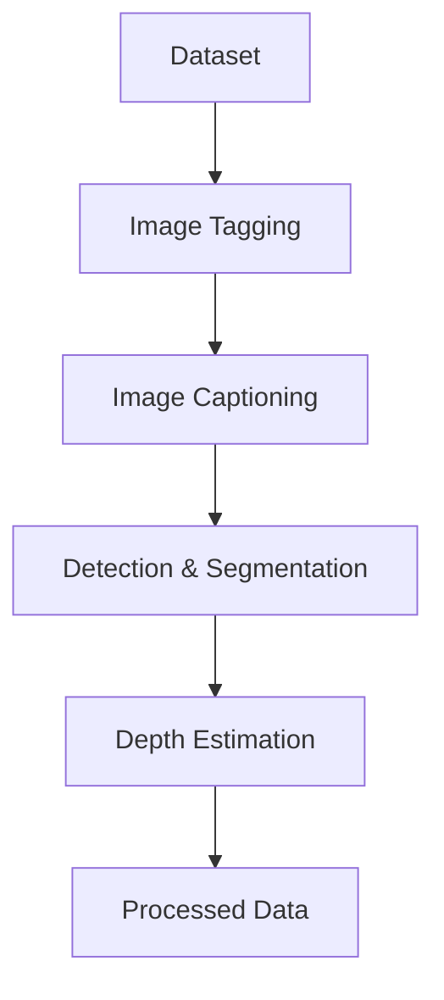

# Cortexia Video Processing Pipeline

A comprehensive computer vision framework for automated image analysis, featuring a three-stage processing pipeline for object tagging, detection/segmentation, and depth estimation.

## Overview

This repository provides a complete workflow for processing image datasets through a sequence of stages:

1.  **Image Tagging**: Automatically identifies and tags objects/areas in images using Vision Language Models.
2.  **Image Captioning**: Generates detailed captions for each image.
3.  **Object Detection & Segmentation**: Detects and segments tagged objects.
4.  **Depth Estimation**: Generates depth maps for processed images.

### Pipeline Diagram



For detailed information on how to run the processing scripts, see the [Scripts README](scripts/README.md).

## Table of Contents

- [Prerequisites](#prerequisites)
- [Installation](#installation)
- [Quick Start](#quick-start)
- [Running with Docker](#running-with-docker)
- [Configuration](#configuration)
- [Troubleshooting](#troubleshooting)

## Prerequisites

### System Requirements

- Python 3.10 or higher
- CUDA-compatible GPU (recommended for optimal performance)
- At least 16GB RAM (32GB recommended for large datasets)
- 30GB+ free disk space for models and processing

### Required Models and Checkpoints

The pipeline requires several pre-trained models that will be automatically downloaded on first use:

- **Vision Language Model**: Qwen/Qwen2.5-VL-7B-Instruct (for image tagging)
- **Object Detection**: IDEA-Research/grounding-dino-base
- **Segmentation**: facebook/sam-vit-huge
- **Depth Estimation**: DepthPro model (requires `checkpoints/depth_pro.pt`)

## Installation

### 1. Clone the Repository

```bash
git clone --recursive https://github.com/DylanLIiii/cortexia_video.git
cd cortexia_video
```

### 2. Install Dependencies

```bash
# Install the package and all dependencies
pip install -e .

# Or using uv (recommended)
uv sync
```

### 3. Environment Setup
Correctly setup the environment variable for users in CHINA and setup model save dir. 
```bash
export HF_HOME=/vita-vepfs-data/fileset1/usr_data/min.dong/model/huggingface
export HF_ENDPOINT=https://hf-mirror.com
```

### 3. Download Required Models

The models will be automatically downloaded when first used, but you can pre-download them:

```bash
# The DepthPro checkpoint should be placed at:
# checkpoints/depth_pro.pt
```

## Quick Start

For a complete processing pipeline on a dataset:

```bash
# 1. Tag images (identify objects/areas)
python scripts/tag_images.py --folder /path/to/your/dataset --config config/heavy_mode.toml

# 2. Detect and segment objects
python scripts/detect_segment_images.py --folder /path/to/your/dataset --config config/heavy_mode.toml

# 3. Generate depth maps
python scripts/batch_depth_estimation.py --folder /path/to/your/dataset --recursive
```

For more detailed usage and examples, please refer to the [Scripts README](scripts/README.md).

## Running with Docker

You can also execute the pipeline inside a Docker container.

### Build the Docker image

```bash
docker build -t cortexia-video .
```

### Run the container

Mount a local folder containing your videos (e.g. `/path/to/your/dataset`) and
run any of the processing scripts inside the container:

```bash
docker run --gpus all -v /path/to/your/dataset:/data cortexia-video \
    python scripts/tag_images.py --folder /data --config config/heavy_mode.toml
```

The required models will be downloaded at runtime as described in the
[Prerequisites](#prerequisites).

## Configuration

The pipeline uses TOML configuration files located in the `config/` directory. You can create your own configuration file by copying and modifying an existing one.

For more details on configuration, see the [Scripts README](scripts/README.md).

## Troubleshooting

For common issues and solutions, please refer to the [Troubleshooting section in the Scripts README](scripts/README.md#troubleshooting).
