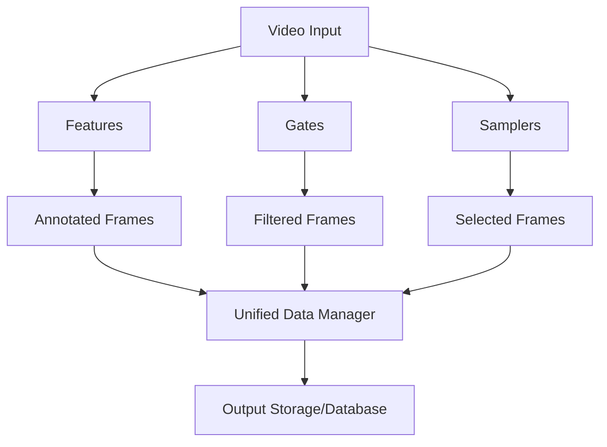

# Cortexia Video SDK

A modular computer vision framework for video annotation and analysis, featuring independent components for feature extraction, quality gating, and intelligent sampling.

## Overview

Cortexia Video is a flexible SDK that provides building blocks for video processing workflows. Instead of rigid pipelines, it offers independent components that can be composed in any order:

### Core Components

1.  **Features**: Extract annotations and analysis from video frames (detection, segmentation, captioning, depth estimation, etc.)
2.  **Gates**: Apply quality filters and criteria to frames (blur detection, content analysis, entropy filtering, etc.)
3.  **Samplers**: Select frames intelligently from video streams (uniform, temporal, quality-based sampling)

### Architecture Diagram



### Key Benefits

- **Modular Design**: Use only the components you need
- **Flexible Composition**: Combine components in any order
- **Registry System**: Easy to extend with custom implementations
- **Unified Data Management**: Consistent interfaces across all components
- **Batch Processing**: Efficient handling of large datasets

## Table of Contents

- [Prerequisites](#prerequisites)
- [Installation](#installation)
- [Quick Start](#quick-start)
- [SDK Usage](#sdk-usage)
- [Available Components](#available-components)
- [Configuration](#configuration)
- [Running with Docker](#running-with-docker)
- [API Reference](#api-reference)
- [Troubleshooting](#troubleshooting)

## Prerequisites

### System Requirements

- Python 3.10 or higher
- CUDA-compatible GPU (recommended for optimal performance)
- At least 16GB RAM (32GB recommended for large datasets)
- 30GB+ free disk space for models and processing

### Required Models and Checkpoints

The SDK uses various pre-trained models that will be automatically downloaded on first use:

- **Vision Language Models**: Qwen/Qwen2.5-VL series (for object listing and description)
- **Object Detection**: IDEA-Research/grounding-dino-base
- **Segmentation**: facebook/sam-vit-huge
- **Depth Estimation**: DepthPro model
- **Feature Extraction**: PE-Core-B16-224 (CLIP-like vision encoder)
- **Image Captioning**: vikhyatk/moondream2

Models are loaded on-demand based on the components you use.

## Installation

### 1. Clone the Repository

```bash
git clone --recursive https://github.com/DylanLIiii/cortexia.git
cd cortexia
```

### 2. Install Dependencies

```bash
# Install the package and all dependencies
pip install -e .

# Or using uv (recommended)
uv sync
```

### 3. Environment Setup

For users in China, set up environment variables for model access:

```bash
export HF_HOME=/vita-vepfs-data/fileset1/usr_data/min.dong/model/huggingface
export HF_ENDPOINT=https://hf-mirror.com
```

### 4. Verify Installation

```bash
# Test the CLI
cortexia-video --help

# Test the SDK
python -c "import cortexia; print('Cortexia SDK installed successfully')"
```

## Quick Start

### Using the CLI

Process video files with the command-line interface:

```bash
# Process a video directory with default settings
cortexia-video --config config/example_config.toml

# Process a specific video
export PROCESSING_INPUT_VIDEO_PATH=/path/to/your/video.mp4
cortexia-video --config config/example_config.toml
```

### Using the SDK

```python
import cortexia
from cortexia.data.models.video import VideoFramePacket
import numpy as np

# Initialize the main SDK interface
cortexia_sdk = cortexia.Cortexia()

# Create individual components
detector = cortexia.create_feature("detection")
captioner = cortexia.create_feature("caption")
blur_gate = cortexia.create_gate("blur")

# Process a single frame
frame_data = np.random.randint(0, 255, (224, 224, 3), dtype=np.uint8)
frame = VideoFramePacket(
    frame_data=frame_data,
    frame_number=0,
    timestamp=0.0,
    source_video_id="test_video"
)

# Apply detection
detection_result = detector.process_frame(frame)
print(f"Detected {len(detection_result.detections)} objects")

# Apply captioning
caption_result = captioner.process_frame(frame)
print(f"Caption: {caption_result.caption}")

# Apply quality gating
blur_result = blur_gate.process_frame(frame)
print(f"Blur score: {blur_result.score}, Passed: {blur_result.passed}")
```

## SDK Usage

### Component Composition

```python
import cortexia
from cortexia.data.io.batch_processor import BatchProcessor

# Create a custom processing pipeline
def custom_pipeline(video_path):
    # Initialize components
    lister = cortexia.create_feature("listing")
    detector = cortexia.create_feature("detection") 
    segmenter = cortexia.create_feature("segmentation")
    blur_gate = cortexia.create_gate("blur")
    entropy_gate = cortexia.create_gate("entropy")
    
    # Process frames with quality gates
    frames = load_video_frames(video_path)  # Your frame loading function
    
    for frame in frames:
        # Apply quality gates first
        if blur_gate.process_frame(frame).passed and entropy_gate.process_frame(frame).passed:
            # Process with features
            objects = lister.process_frame(frame)
            detections = detector.process_frame(frame)
            segments = segmenter.process_frame(frame)
            
            # Combine results
            yield {
                'frame': frame,
                'objects': objects,
                'detections': detections,
                'segments': segments
            }
```

### Batch Processing

```python
import cortexia
from cortexia.data.io.batch_processor import BatchProcessor

# Process large datasets efficiently
def process_dataset(image_paths):
    detector = cortexia.create_feature("detection")
    
    def load_func(paths):
        return [load_image(path) for path in paths]
    
    def inference_func(frames):
        return detector.process_batch(frames)
    
    processor = BatchProcessor(batch_size=8)
    processor.load_indices(image_paths)
    
    results = processor.process_batch(
        load_func=load_func,
        inference_func=inference_func,
        save_func=save_results  # Your save function
    )
    
    return results
```

### Custom Components

```python
from cortexia.features.base import BaseFeature
from cortexia.data.models.result.base_result import BaseResult

class CustomFeature(BaseFeature):
    output_schema = CustomResult
    required_inputs = []
    required_fields = []
    
    def _initialize(self):
        # Initialize your models here
        pass
    
    def process_frame(self, frame, **inputs):
        # Your processing logic
        return CustomResult(custom_field="result")
    
    @property
    def name(self):
        return "custom_feature"
    
    @property 
    def description(self):
        return "A custom feature implementation"

# Register your component
@FEATURE_REGISTRY.decorator("custom_feature")
class RegisteredCustomFeature(CustomFeature):
    pass
```

## Available Components

### Features (Annotation Components)

| Feature | Description | Models Used |
|---------|-------------|-------------|
| `listing` | Object listing and tagging | Qwen2.5-VL, RAM++ |
| `detection` | Object detection with bounding boxes | Grounding DINO, YOLO-World |
| `segmentation` | Semantic segmentation | SAM-ViT |
| `caption` | Image captioning | Moondream2, DAM-3B |
| `description` | Detailed scene description | Qwen2.5-VL, DAM-3B |
| `depth` | Depth estimation | DepthPro |
| `feature_extraction` | Feature embedding extraction | PE-Core-B16-224 |

### Gates (Quality Filters)

| Gate | Description | Use Case |
|------|-------------|----------|
| `blur` | Blur detection and scoring | Filter out low-quality frames |
| `entropy` | Image entropy analysis | Select informative frames |
| `clip` | CLIP-based content filtering | Filter by content relevance |
| `hash` | Perceptual hash-based deduplication | Remove duplicate frames |
| `grid` | Grid-based quality assessment | Assess frame composition |

### Samplers (Frame Selection)

| Sampler | Description | Best For |
|---------|-------------|----------|
| `uniform` | Uniform temporal sampling | General video processing |
| `dsk` | Dominant set clustering | Key frame extraction |
| `temporal` | Temporal coherence sampling | Video summarization |

### Listing Available Components

```python
import cortexia

# List all available features
print("Available features:", cortexia.list_features())

# List all available gates  
print("Available gates:", cortexia.list_gates())

# Get component information
detector = cortexia.get_feature("detection")
print(f"Detector: {detector.name} - {detector.description}")
```

## Configuration

Cortexia uses TOML configuration files for flexible component setup. Configuration files are located in the `config/` directory.

### Example Configuration

```toml
[logging]
level = "INFO"
file = "app.log"

[model_settings]
object_listing_model = "Qwen/Qwen2.5-VL-3B-Instruct"
object_detection_model = "IDEA-Research/grounding-dino-base"
segmentation_model = "facebook/sam-vit-huge"
description_model = "nvidia/DAM-3B-Self-Contained"
clip_feature_model = "PE-Core-B16-224"
image_captioning_model = "vikhyatk/moondream2"

[detection_settings]
box_threshold = 0.3
text_threshold = 0.3

[description_settings]
temperature = 0.2
top_p = 0.5
num_beams = 1
max_tokens = 512

[processing]
default_mode = "list | detect | segment | extract_scene | extract_object"
input_video_path = "sample_data/"
output_directory = "output/"
frame_interval = 50
batch_size = 2
image_format = "jpg"

[visualization]
enabled = true
annotated_image_format = "jpg"
contour_enabled = true
contour_thickness = 3
description_viz_enabled = false
```

### Configuration Modes

- **`config/example_config.toml`**: Balanced configuration for general use
- **`config/light_mode.toml`**: Lightweight configuration for faster processing
- **`config/heavy_mode.toml`**: High-quality configuration with larger models

### Loading Configuration

```python
from cortexia.core.config.manager import ConfigManager

# Load configuration from file
config_manager = ConfigManager(config_file_path="config/example_config.toml")
config_manager.load_config()

# Access configuration parameters
model_name = config_manager.get_param("model_settings.object_listing_model")
batch_size = config_manager.get_param("processing.batch_size", 4)
```

The required models will be downloaded at runtime as described in the [Prerequisites](#prerequisites).

## API Reference

### Core Classes

#### Cortexia
Main SDK interface for component management.

```python
cortexia_sdk = cortexia.Cortexia()

# Component management
feature = cortexia_sdk.create_feature("detection")
gate = cortexia_sdk.create_gate("blur")

# Registry access
available_features = cortexia_sdk.list_features()
available_gates = cortexia_sdk.list_gates()
```

#### BaseFeature
Base class for all annotation features.

```python
class CustomFeature(BaseFeature):
    output_schema = CustomResult
    required_inputs = []
    required_fields = []
    
    def _initialize(self):
        # Initialize models
        pass
    
    def process_frame(self, frame, **inputs):
        # Process single frame
        return CustomResult(...)
    
    def process_batch(self, frames):
        # Process multiple frames efficiently
        return [self.process_frame(frame) for frame in frames]
```

#### BaseGate
Base class for all quality gates.

```python
class CustomGate(BaseGate):
    def process_frame(self, frame):
        # Return boolean decision
        return True/False
    
    def process_with_metadata(self, frame):
        # Return detailed results with scores
        return GateResult(passed=True, score=0.8, metadata={})
```

### Data Models

#### VideoFramePacket
Container for video frame data.

```python
frame = VideoFramePacket(
    frame_data=np.ndarray,  # HxWxC numpy array
    frame_number=int,
    timestamp=float,
    source_video_id=str
)
```

#### BaseResult
Base class for processing results.

```python
class DetectionResult(BaseResult):
    detections: List[Detection]  # List of detected objects
    confidence: float  # Overall confidence
```

### Exceptions

```python
from cortexia.api.exceptions import CortexiaError, ModelLoadError, ProcessingError

try:
    result = detector.process_frame(frame)
except ModelLoadError as e:
    print(f"Failed to load model: {e}")
except ProcessingError as e:
    print(f"Processing failed: {e}")
```

## Troubleshooting

### Common Issues

**Model Loading Failures**
```bash
# Check model cache and permissions
ls -la ~/.cache/huggingface/
export HF_HOME=/path/to/model/cache
```

**CUDA Out of Memory**
```python
# Reduce batch size in configuration
[processing]
batch_size = 1  # Reduce from default
```

**Import Errors**
```bash
# Ensure proper installation
pip install -e .
# Or check dependencies
uv sync
```

**Configuration Issues**
```python
# Validate configuration
from cortexia.core.config.manager import ConfigManager
config = ConfigManager("config/your_config.toml")
config.load_config()  # Will raise exceptions for invalid config
```

### Getting Help

- Check the [documentation](docs/) for detailed architecture information
- Review the [tests](tests/) for usage examples
- Ensure all dependencies are properly installed
- Verify model download permissions and internet connectivity

For additional support, please refer to the project documentation or create an issue in the repository.
