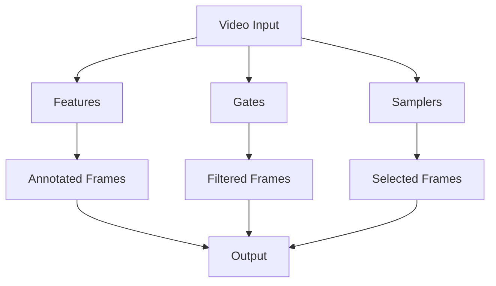

# Getting Started with Cortexia Video SDK

Welcome to the getting started guide for Cortexia Video SDK! This guide will walk you through your first steps with the modular computer vision framework for video annotation and analysis.

## What You'll Learn

- How to install and set up Cortexia Video SDK
- Basic concepts and architecture overview
- Your first video processing workflow
- Common usage patterns and examples

## Prerequisites

Before you begin, ensure you have:

- **Python 3.10 or higher** installed
- **CUDA-compatible GPU** (recommended for optimal performance)
- **At least 16GB RAM** (32GB recommended for large datasets)
- **30GB+ free disk space** for models and processing

## Installation

### Quick Install

```bash
# Clone the repository
git clone --recursive https://github.com/DylanLIiii/cortexia.git
cd cortexia

# Install using uv (recommended)
uv sync

# Or using pip
pip install -e .
```

### Verify Installation

```bash
# Test the CLI
cortexia-video --help

# Test the SDK
python -c "import cortexia; print('Cortexia SDK installed successfully')"
```

For detailed installation instructions, see the [Installation Guide](installation.md).

## Core Concepts

### Modular Architecture

Cortexia Video SDK is built on a modular architecture with three main component types:



#### Features
Features extract annotations and analysis from video frames:
- **Detection**: Object detection with bounding boxes
- **Segmentation**: Semantic segmentation masks
- **Caption**: Image captioning and description
- **Depth**: Depth estimation
- **Listing**: Object listing and tagging
- **Feature Extraction**: Feature embeddings

#### Gates
Gates apply quality filters and criteria to frames:
- **Blur**: Blur detection and scoring
- **Entropy**: Image entropy analysis
- **CLIP**: CLIP-based content filtering
- **Hash**: Perceptual hash-based deduplication
- **Grid**: Grid-based quality assessment

#### Samplers
Samplers select frames intelligently from video streams:
- **Uniform**: Uniform temporal sampling
- **DSK**: Dominant set clustering for key frames
- **Temporal**: Temporal coherence sampling

### Registry System

Cortexia uses a registry system for component management:

```python
# List available components
features = cortexia.list_features()
gates = cortexia.list_gates()

# Create components
detector = cortexia.create_feature("detection")
blur_gate = cortexia.create_gate("blur")
```

## Your First Workflow

Let's create a simple video processing workflow:

### Step 1: Initialize the SDK

```python
import cortexia
import numpy as np
from cortexia.data.models.video import VideoFramePacket

# Initialize the main SDK interface
cortexia_sdk = cortexia.Cortexia()
```

### Step 2: Create Components

```python
# Create feature components
detector = cortexia.create_feature("detection")
captioner = cortexia.create_feature("caption")

# Create gate components
blur_gate = cortexia.create_gate("blur")
entropy_gate = cortexia.create_gate("entropy")
```

### Step 3: Prepare Video Frame

```python
# Load a video frame (example with synthetic data)
frame_data = np.random.randint(0, 255, (224, 224, 3), dtype=np.uint8)
frame = VideoFramePacket(
    frame_data=frame_data,
    frame_number=0,
    timestamp=0.0,
    source_video_id="sample_video"
)
```

### Step 4: Apply Quality Gates

```python
# Apply quality gates first
blur_result = blur_gate.process_frame(frame)
entropy_result = entropy_gate.process_frame(frame)

if blur_result.passed and entropy_result.passed:
    print("Frame passed quality gates")
    
    # Process with features
    detection_result = detector.process_frame(frame)
    caption_result = captioner.process_frame(frame)
    
    print(f"Detected {len(detection_result.detections)} objects")
    print(f"Caption: {caption_result.caption}")
else:
    print("Frame failed quality gates")
    print(f"Blur score: {blur_result.score}")
    print(f"Entropy score: {entropy_result.score}")
```

## Common Usage Patterns

### Pattern 1: Basic Object Detection

```python
import cortexia

# Initialize
cortexia_sdk = cortexia.Cortexia()

# Create detector
detector = cortexia.create_feature("detection")

# Process frame
result = detector.process_frame(frame)

# Access results
for detection in result.detections:
    print(f"Object: {detection.class_name}")
    print(f"Confidence: {detection.confidence}")
    print(f"Bounding box: {detection.bbox}")
```

### Pattern 2: Quality Filtering + Annotation

```python
import cortexia

# Initialize components
blur_gate = cortexia.create_gate("blur")
detector = cortexia.create_feature("detection")
captioner = cortexia.create_feature("caption")

# Process with quality filtering
if blur_gate.process_frame(frame).passed:
    # Frame is good quality, process with features
    detections = detector.process_frame(frame)
    caption = captioner.process_frame(frame)
    
    # Combine results
    print(f"Found {len(detections.detections)} objects")
    print(f"Scene description: {caption.caption}")
```

### Pattern 3: Batch Processing

```python
import cortexia
from cortexia.data.io.batch_processor import BatchProcessor

# Create detector
detector = cortexia.create_feature("detection")

# Setup batch processor
def load_batch(frame_paths):
    return [load_frame(path) for path in frame_paths]

def process_batch(frames):
    return detector.process_batch(frames)

processor = BatchProcessor(batch_size=8)
results = processor.process_batch(
    load_func=load_batch,
    inference_func=process_batch,
    save_func=save_results
)
```

### Pattern 4: Custom Pipeline

```python
import cortexia

def custom_video_pipeline(video_path):
    # Initialize components
    lister = cortexia.create_feature("listing")
    detector = cortexia.create_feature("detection")
    segmenter = cortexia.create_feature("segmentation")
    blur_gate = cortexia.create_gate("blur")
    
    # Process video frames
    for frame in load_video_frames(video_path):
        # Quality check
        if not blur_gate.process_frame(frame).passed:
            continue
            
        # Extract annotations
        objects = lister.process_frame(frame)
        detections = detector.process_frame(frame)
        segments = segmenter.process_frame(frame)
        
        # Yield combined results
        yield {
            'frame': frame,
            'objects': objects,
            'detections': detections,
            'segments': segments
        }
```

## Working with Real Videos

### Loading Video Frames

```python
import cv2

def load_video_frames(video_path, max_frames=None):
    """Load frames from a video file."""
    cap = cv2.VideoCapture(video_path)
    frame_count = 0
    
    while cap.isOpened() and (max_frames is None or frame_count < max_frames):
        ret, frame = cap.read()
        if not ret:
            break
            
        # Convert BGR to RGB
        frame_rgb = cv2.cvtColor(frame, cv2.COLOR_BGR2RGB)
        
        # Create VideoFramePacket
        frame_packet = VideoFramePacket(
            frame_data=frame_rgb,
            frame_number=frame_count,
            timestamp=frame_count / 30.0,  # Assuming 30 FPS
            source_video_id=video_path
        )
        
        yield frame_packet
        frame_count += 1
    
    cap.release()
```

### Processing a Video File

```python
def process_video_file(video_path, output_path):
    """Process a complete video file."""
    results = []
    
    # Initialize components
    detector = cortexia.create_feature("detection")
    blur_gate = cortexia.create_gate("blur")
    
    # Process each frame
    for frame in load_video_frames(video_path):
        # Quality check
        if not blur_gate.process_frame(frame).passed:
            continue
            
        # Process frame
        result = detector.process_frame(frame)
        results.append({
            'frame_number': frame.frame_number,
            'timestamp': frame.timestamp,
            'detections': result.detections
        })
    
    # Save results
    save_results(results, output_path)
    return results
```

## Configuration

Cortexia Video SDK uses TOML configuration files. Here's a basic configuration:

```toml
[logging]
level = "INFO"

[model_settings]
object_detection_model = "IDEA-Research/grounding-dino-base"
segmentation_model = "facebook/sam-vit-huge"

[processing]
batch_size = 4
frame_interval = 30

[detection_settings]
box_threshold = 0.3
text_threshold = 0.3
```

Load configuration:

```python
from cortexia.core.config.manager import ConfigManager

config_manager = ConfigManager("config/example_config.toml")
config_manager.load_config()

# Access configuration
batch_size = config_manager.get_param("processing.batch_size", 4)
```

## Next Steps

Now that you've completed the getting started guide, you can:

1. **Explore Examples**: Check the [cookbook/](../../cookbook/) directory for practical examples
2. **Learn Advanced Usage**: Read the [Advanced Usage](advanced_usage.md) guide
3. **Understand Architecture**: Explore the [Architecture](../architecture/) documentation
4. **API Reference**: Dive into the [API Reference](../api_reference/) for detailed information

## Troubleshooting

### Common Issues

**Import Errors**
```bash
# Ensure proper installation
pip install -e .

# Check Python version (must be 3.10+)
python --version
```

**Model Loading Issues**
```bash
# Check model cache permissions
ls -la ~/.cache/huggingface/

# Set custom model cache
export HF_HOME=/path/to/model/cache
```

**Memory Issues**
```python
# Reduce batch size
config_manager.set_param("processing.batch_size", 1)

# Use CPU instead of GPU
import torch
torch.set_num_threads(1)
```

For more troubleshooting information, see the [Troubleshooting](troubleshooting.md) guide.

## Need Help?

- **Documentation**: Browse this documentation site
- **Examples**: Check the [cookbook/](../../cookbook/) directory
- **Issues**: Report bugs on GitHub
- **Community**: Join discussions and ask questions

Happy coding with Cortexia Video SDK! 🚀