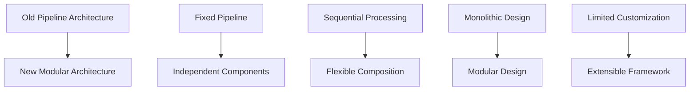

# Migration Guide

This guide helps you migrate from previous versions of Cortexia Video SDK to the current modular architecture. It covers breaking changes, new features, and step-by-step migration instructions.

## Overview of Changes

The Cortexia Video SDK has evolved from a pipeline-based architecture to a modular component system. This change provides:

- **Better modularity**: Each component is independent and composable
- **Improved flexibility**: Mix and match components as needed
- **Enhanced testability**: Test components independently
- **Simplified extensibility**: Easy to add new components

### Key Architectural Changes



## Breaking Changes

### 1. Component Registration System

**Before (Old System):**
```python
# Manual component creation
from cortexia.features.detection.detector import ObjectDetector
from cortexia.gates.blur_gate import BlurGate

detector = ObjectDetector(model_name="grounding-dino")
blur_gate = BlurGate(threshold=0.5)
```

**After (New System):**
```python
# Registry-based component creation
import cortexia

# List available components
features = cortexia.list_features()
gates = cortexia.list_gates()

# Create components through registry
detector = cortexia.create_feature("detection")
blur_gate = cortexia.create_gate("blur")
```

### 2. Configuration Management

**Before (Old System):**
```python
# Direct configuration
config = {
    "model_name": "grounding-dino",
    "threshold": 0.3,
    "batch_size": 4
}
detector = ObjectDetector(config)
```

**After (New System):**
```python
# TOML configuration with ConfigManager
from cortexia.core.config.manager import ConfigManager

config_manager = ConfigManager("config/example_config.toml")
config_manager.load_config()

# Components auto-load configuration
detector = cortexia.create_feature("detection")
```

### 3. Data Flow Models

**Before (Old System):**
```python
# Simple frame data
class FrameData:
    def __init__(self, image, metadata):
        self.image = image
        self.metadata = metadata
```

**After (New System):**
```python
# Rich data models with type safety
from cortexia.data.models.video import VideoFramePacket, AnnotatedFramePacket, TaggedFramePacket

# Rich frame data with full context
frame = VideoFramePacket(
    frame_data=image,
    frame_number=0,
    timestamp=0.0,
    source_video_id="video.mp4"
)
```

## Migration Steps

### Step 1: Update Installation

```bash
# Ensure you have the latest version
git pull origin main
pip install -e .

# Verify installation
python -c "import cortexia; print('Cortexia SDK version:', cortexia.__version__)"
```

### Step 2: Update Configuration Files

Convert your existing configuration to the new TOML format:

**Old Configuration (JSON/YAML):**
```json
{
  "models": {
    "detection": "grounding-dino",
    "segmentation": "sam-vit-huge"
  },
  "processing": {
    "batch_size": 4,
    "frame_interval": 30
  }
}
```

**New Configuration (TOML):**
```toml
[model_settings]
object_detection_model = "IDEA-Research/grounding-dino-base"
segmentation_model = "facebook/sam-vit-huge"

[processing]
batch_size = 4
frame_interval = 30
```

### Step 3: Update Component Creation

**Old Code:**
```python
from cortexia.features.detection.detector import ObjectDetector
from cortexia.features.caption.captioner import ImageCaptioner
from cortexia.gates.blur_gate import BlurGate

# Create components
detector = ObjectDetector(model_name="grounding-dino")
captioner = ImageCaptioner(model_name="blip")
blur_gate = BlurGate(threshold=0.5)
```

**New Code:**
```python
import cortexia

# Create components through registry
detector = cortexia.create_feature("detection")
captioner = cortexia.create_feature("caption")
blur_gate = cortexia.create_gate("blur")

# Configuration is loaded automatically
```

### Step 4: Update Data Processing

**Old Code:**
```python
def process_frame_old(frame_data):
    # Simple processing
    detections = detector.process(frame_data)
    if blur_gate.check(frame_data):
        return detections
    return None
```

**New Code:**
```python
def process_frame_new(frame_packet):
    # Rich processing with full context
    gate_result = blur_gate.process_frame(frame_packet)
    
    if gate_result.passed:
        # Process with features
        annotated_frame = detector.process_frame(frame_packet)
        return annotated_frame
    else:
        return None
```

### Step 5: Update Batch Processing

**Old Code:**
```python
def batch_process_old(frames):
    results = []
    for frame in frames:
        result = detector.process(frame)
        results.append(result)
    return results
```

**New Code:**
```python
def batch_process_new(frame_packets):
    # Use built-in batch processing
    return detector.process_batch(frame_packets)
```

## Migration Examples

### Example 1: Basic Object Detection Pipeline

**Before Migration:**
```python
from cortexia.features.detection.detector import ObjectDetector
from cortexia.gates.blur_gate import BlurGate
import cv2

# Old pipeline
detector = ObjectDetector(model_name="grounding-dino")
blur_gate = BlurGate(threshold=0.5)

def process_video_old(video_path):
    cap = cv2.VideoCapture(video_path)
    results = []
    
    while cap.isOpened():
        ret, frame = cap.read()
        if not ret:
            break
            
        # Quality check
        if blur_gate.check(frame):
            detections = detector.process(frame)
            results.append(detections)
    
    cap.release()
    return results
```

**After Migration:**
```python
import cortexia
import cv2
from cortexia.data.models.video import VideoFramePacket

# New pipeline
detector = cortexia.create_feature("detection")
blur_gate = cortexia.create_gate("blur")

def process_video_new(video_path):
    cap = cv2.VideoCapture(video_path)
    results = []
    
    while cap.isOpened():
        ret, frame = cap.read()
        if not ret:
            break
            
        # Convert to RGB
        frame_rgb = cv2.cvtColor(frame, cv2.COLOR_BGR2RGB)
        
        # Create rich frame packet
        frame_packet = VideoFramePacket(
            frame_data=frame_rgb,
            frame_number=len(results),
            timestamp=len(results) / 30.0,
            source_video_id=video_path
        )
        
        # Quality check with rich results
        gate_result = blur_gate.process_frame(frame_packet)
        
        if gate_result.passed:
            # Process with feature
            annotated_frame = detector.process_frame(frame_packet)
            results.append(annotated_frame)
    
    cap.release()
    return results
```

### Example 2: Multi-Component Pipeline

**Before Migration:**
```python
from cortexia.features.detection.detector import ObjectDetector
from cortexia.features.segmentation.segmenter import ImageSegmenter
from cortexia.features.caption.captioner import ImageCaptioner
from cortexia.gates.blur_gate import BlurGate
from cortexia.gates.entropy_gate import EntropyGate

# Manual component setup
detector = ObjectDetector(model_name="grounding-dino")
segmenter = ImageSegmenter(model_name="sam-vit-huge")
captioner = ImageCaptioner(model_name="blip")
blur_gate = BlurGate(threshold=0.5)
entropy_gate = EntropyGate(threshold=5.0)

def process_frame_complex_old(frame):
    # Sequential quality checks
    if not blur_gate.check(frame):
        return None
    if not entropy_gate.check(frame):
        return None
    
    # Process with all features
    detections = detector.process(frame)
    segments = segmenter.process(frame)
    caption = captioner.process(frame)
    
    return {
        'detections': detections,
        'segments': segments,
        'caption': caption
    }
```

**After Migration:**
```python
import cortexia
from cortexia.data.models.video import VideoFramePacket

# Registry-based component setup
detector = cortexia.create_feature("detection")
segmenter = cortexia.create_feature("segmentation")
captioner = cortexia.create_feature("caption")
blur_gate = cortexia.create_gate("blur")
entropy_gate = cortexia.create_gate("entropy")

def process_frame_complex_new(frame_packet):
    # Process with gates (rich results)
    blur_result = blur_gate.process_frame(frame_packet)
    entropy_result = entropy_gate.process_frame(frame_packet)
    
    # Check if frame passes all gates
    if not (blur_result.passed and entropy_result.passed):
        return None
    
    # Process with features (batch processing available)
    detections = detector.process_frame(frame_packet)
    segments = segmenter.process_frame(frame_packet)
    caption = captioner.process_frame(frame_packet)
    
    # Return rich annotated frame
    return {
        'detections': detections,
        'segments': segments,
        'caption': caption,
        'gate_results': {
            'blur': blur_result,
            'entropy': entropy_result
        }
    }
```

### Example 3: Custom Component Development

**Before Migration:**
```python
from cortexia.features.base import BaseFeature

class CustomDetector(BaseFeature):
    def __init__(self, model_name):
        self.model_name = model_name
        self.model = self._load_model()
    
    def process(self, frame):
        # Custom processing logic
        results = self.model(frame)
        return results
    
    def _load_model(self):
        # Model loading logic
        pass

# Manual registration
custom_detector = CustomDetector("custom-model")
```

**After Migration:**
```python
from cortexia.features.base import BaseFeature
from cortexia.core.registry import get_model_hub

# Get registry for custom components
CUSTOM_DETECTOR_REGISTRY = get_model_hub("custom_detector")

@CUSTOM_DETECTOR_REGISTRY.decorator("my_custom_detector", aliases=["custom"])
class CustomDetector(BaseFeature):
    def __init__(self, config):
        super().__init__(config)
        self.model_name = config.get("model_name", "default-model")
        self.model = self._load_model()
    
    def process_frame(self, frame_packet):
        # Custom processing logic with rich frame data
        results = self.model(frame_packet.frame_data)
        return results
    
    def _load_model(self):
        # Model loading logic
        pass

# Create through registry
custom_detector = cortexia.create_feature("custom_detector", "my_custom_detector")
```

## Backward Compatibility

### What's Still Supported

The new architecture maintains backward compatibility for:

1. **Basic frame processing**: Simple frame data still works
2. **Component interfaces**: Existing method signatures are preserved
3. **Configuration loading**: Old configuration files can be converted
4. **Result formats**: Basic result structures are still available

### Migration Timeline

- **Phase 1 (Immediate)**: Update component creation and configuration
- **Phase 2 (Short-term)**: Migrate to rich data models
- **Phase 3 (Medium-term)**: Adopt new batch processing and optimization features
- **Phase 4 (Long-term)**: Implement custom components using new registry system

## Common Migration Issues

### Issue 1: Component Not Found

**Problem:**
```python
# Error: Component not found
detector = cortexia.create_feature("unknown_feature")
```

**Solution:**
```python
# List available components
features = cortexia.list_features()
print("Available features:", features)

# Use correct component name
detector = cortexia.create_feature("detection")
```

### Issue 2: Configuration Loading Failed

**Problem:**
```python
# Error: Configuration file not found or invalid
config_manager = ConfigManager("invalid_config.toml")
```

**Solution:**
```python
# Check configuration file exists
import os
config_path = "config/example_config.toml"

if not os.path.exists(config_path):
    print(f"Configuration file not found: {config_path}")
    # Use default configuration
    config_manager = ConfigManager()
else:
    config_manager = ConfigManager(config_path)
    config_manager.load_config()
```

### Issue 3: Data Model Mismatch

**Problem:**
```python
# Error: Expected VideoFramePacket, got numpy array
detector.process_frame(numpy_array)
```

**Solution:**
```python
# Convert to proper data model
from cortexia.data.models.video import VideoFramePacket

frame_packet = VideoFramePacket(
    frame_data=numpy_array,
    frame_number=0,
    timestamp=0.0,
    source_video_id="video.mp4"
)

result = detector.process_frame(frame_packet)
```

### Issue 4: Performance Regression

**Problem:**
```python
# Processing is slower after migration
```

**Solution:**
```python
# Enable batch processing
results = detector.process_batch(frame_packets)

# Optimize configuration
config_manager.set_param("processing.batch_size", 8)
config_manager.set_param("processing.num_workers", 4)

# Use appropriate models
config_manager.set_param("model_settings.object_detection_model", "YOLO-World/small")
```

## Testing Your Migration

### Migration Validation Checklist

- [ ] All components can be created through registry
- [ ] Configuration files load without errors
- [ ] Basic frame processing works
- [ ] Batch processing functions correctly
- [ ] Gate decisions are consistent
- [ ] Performance is acceptable
- [ ] Custom components (if any) work with new system

### Test Script

```python
import cortexia
import numpy as np
from cortexia.data.models.video import VideoFramePacket

def test_migration():
    """Test migration success."""
    
    print("Testing component creation...")
    try:
        detector = cortexia.create_feature("detection")
        blur_gate = cortexia.create_gate("blur")
        print("✓ Component creation successful")
    except Exception as e:
        print(f"✗ Component creation failed: {e}")
        return False
    
    print("Testing configuration...")
    try:
        from cortexia.core.config.manager import ConfigManager
        config_manager = ConfigManager("config/example_config.toml")
        config_manager.load_config()
        print("✓ Configuration loading successful")
    except Exception as e:
        print(f"✗ Configuration loading failed: {e}")
        return False
    
    print("Testing frame processing...")
    try:
        # Create test frame
        frame_data = np.random.randint(0, 255, (224, 224, 3), dtype=np.uint8)
        frame_packet = VideoFramePacket(
            frame_data=frame_data,
            frame_number=0,
            timestamp=0.0,
            source_video_id="test"
        )
        
        # Test gate processing
        gate_result = blur_gate.process_frame(frame_packet)
        print(f"✓ Gate processing successful: {gate_result.passed}")
        
        # Test feature processing
        if gate_result.passed:
            result = detector.process_frame(frame_packet)
            print("✓ Feature processing successful")
        
    except Exception as e:
        print(f"✗ Frame processing failed: {e}")
        return False
    
    print("✓ Migration test completed successfully!")
    return True

if __name__ == "__main__":
    test_migration()
```

## Getting Help

### Resources

- **Documentation**: [Architecture Overview](../architecture/modular_design.md)
- **Examples**: [Cookbook](../../cookbook/) directory
- **API Reference**: [API Documentation](../api_reference/overview.md)
- **Issues**: [GitHub Issues](https://github.com/DylanLIiii/cortexia/issues)

### Support

If you encounter issues during migration:

1. **Check this guide**: Review common issues and solutions
2. **Run test script**: Use the validation script above
3. **Check examples**: Look at updated examples in cookbook/
4. **Create issue**: Report problems on GitHub with migration details

## Next Steps

After completing migration:

1. **Explore new features**: Try batch processing and optimization
2. **Custom components**: Develop custom components using registry system
3. **Performance tuning**: Optimize configuration for your use case
4. **Advanced patterns**: Implement complex processing pipelines

Welcome to the new modular Cortexia Video SDK! 🚀